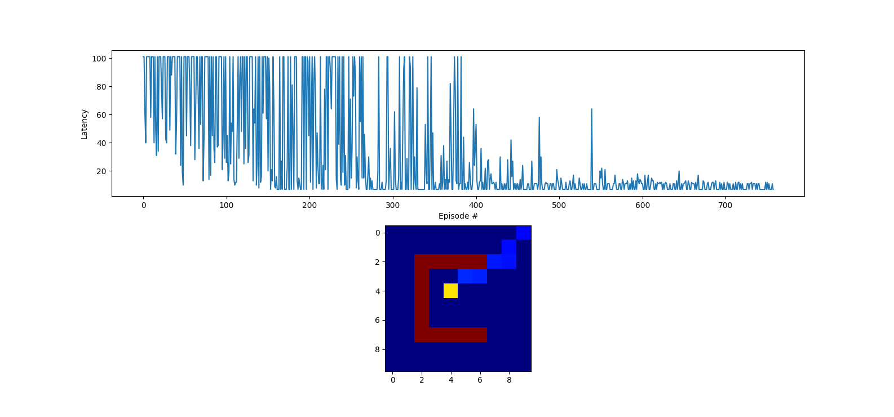

# Reinforcement learning from images in a grid-world

A basic example of an SNN_V1 with the grid environment from the paper "Combining STDP and Binary Networks for Reinforcement Learning from Images and Sparse Rewards"


## Requirements

To install requirements, run:

```setup
pip install -r requirements.txt
```

## Usage
run main.py

Sample result:
<p align="center">

</p>
